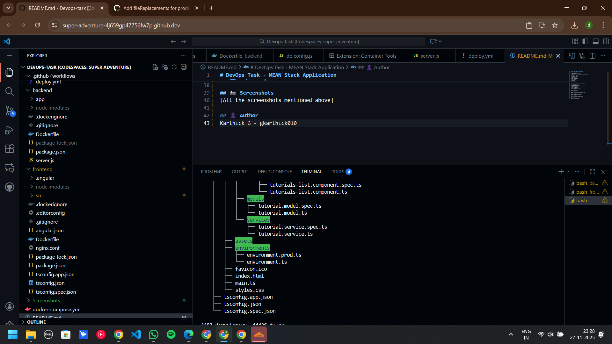
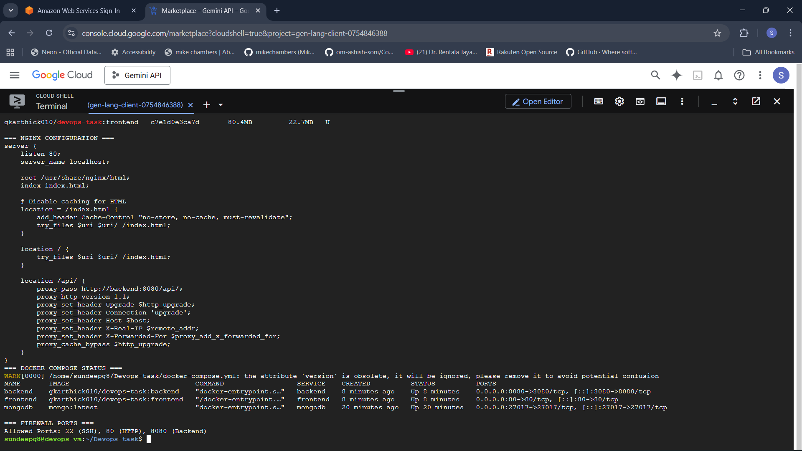
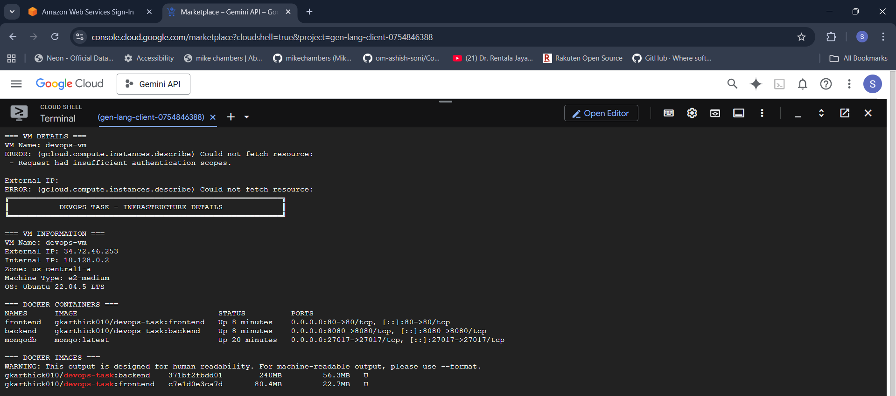
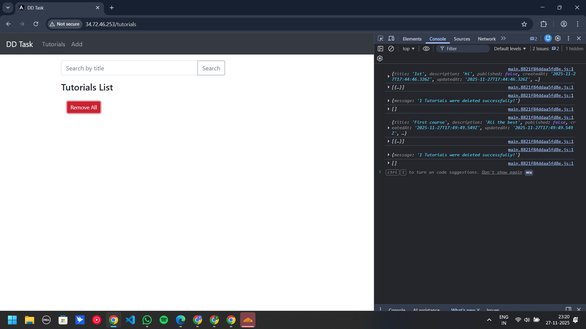
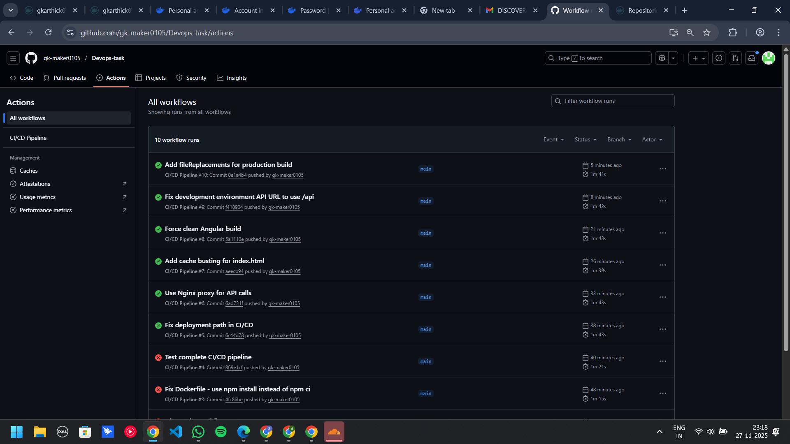

# DevOps Task - MEAN Stack Application

## 📝 Assignment Submission
**Candidate:** Karthick G  
**Position:** DevOps Engineer Intern  
**Company:** Discover Dollar Inc.  
**Submission Date:** November 28, 2025

---

## 🔗 Quick Links
- **Live Application:** http://34.72.46.253
- **GitHub Repository:** https://github.com/gk-maker0105/Devops-task
- **Docker Hub:** https://hub.docker.com/u/gkarthick010

---

## 📋 Assignment Requirements Completed

### ✅ Repository Setup
- Created GitHub repository with complete code
- All source files committed and pushed

### ✅ Containerization
- **Backend Dockerfile:** `backend/Dockerfile`
- **Frontend Dockerfile:** `frontend/Dockerfile`
- **Docker Compose:** `docker-compose.yml`
- Images pushed to Docker Hub:
  - `gkarthick010/devops-task:backend`
  - `gkarthick010/devops-task:frontend`

### ✅ Cloud Deployment
- **Platform:** Google Cloud Platform (GCP)
- **VM:** Ubuntu 22.04 LTS (e2-medium)
- **IP Address:** 34.72.46.253
- **Zone:** us-central1-a

### ✅ Database Setup
- MongoDB running in Docker container
- Using official `mongo:latest` image
- Configured in docker-compose.yml

### ✅ CI/CD Pipeline
- **Tool:** GitHub Actions
- **Workflow File:** `.github/workflows/deploy.yml`
- Automated pipeline:
  1. Builds Docker images on push to main
  2. Pushes images to Docker Hub
  3. Deploys to VM automatically

### ✅ Nginx Reverse Proxy
- Configured in `frontend/nginx.conf`
- Application accessible on port 80
- API proxied to backend on port 8080

---

## 🏗️ Architecture

```
Internet (Port 80)
       ↓
   Nginx (Frontend Container)
       ↓
   Backend API (Port 8080)
       ↓
   MongoDB (Port 27017)
```

---

## 📁 Project Structure

```
Devops-task/
├── .github/workflows/
│   └── deploy.yml              # CI/CD configuration
├── backend/
│   ├── Dockerfile              # Backend containerization
│   └── server.js               # Express API
├── frontend/
│   ├── Dockerfile              # Frontend containerization
│   └── nginx.conf              # Nginx configuration
├── docker-compose.yml          # Container orchestration
├── Screenshots/                # Assignment screenshots
└── README.md
```

---

## 🚀 Setup Instructions

### Local Development

**Backend:**
```bash
cd backend
npm install
node server.js
```

**Frontend:**
```bash
cd frontend
npm install
ng serve
```

### Docker Deployment

```bash
# Clone repository
git clone https://github.com/gk-maker0105/Devops-task.git
cd Devops-task

# Start all services
docker compose up -d

# Check status
docker ps
```

---

## 📸 Screenshots

### 1. Project Structure


### 2. Nginx Configuration


### 3. Infrastructure (VM + Docker)



### 4. Application - Tutorials List


### 5. CRUD Operations Working(Deleted both records)



### 7. Docker Hub Images


### 8. GitHub Actions - CI/CD


---

## 🔧 Technologies Used

- **Frontend:** Angular 15, TypeScript, Bootstrap
- **Backend:** Node.js, Express.js
- **Database:** MongoDB
- **DevOps:** Docker, Docker Compose, GitHub Actions
- **Cloud:** Google Cloud Platform
- **Web Server:** Nginx

---

## 🐋 Docker Images

Both images available on Docker Hub:

```bash
# Backend
docker pull gkarthick010/devops-task:backend

# Frontend
docker pull gkarthick010/devops-task:frontend
```

---

## 🔄 CI/CD Pipeline

GitHub Actions workflow automatically:
1. Builds Docker images when code is pushed
2. Pushes images to Docker Hub
3. SSHs into GCP VM
4. Pulls latest images
5. Restarts containers

**Workflow Status:** ✅ All workflows passing

---

## 🌐 Deployment Details

**VM Information:**
- Name: devops-vm
- External IP: 34.72.46.253
- Internal IP: 10.128.0.2
- Zone: us-central1-a
- Machine Type: e2-medium
- OS: Ubuntu 22.04.5 LTS

**Running Containers:**
- frontend (Port 80)
- backend (Port 8080)
- mongodb (Port 27017)

**Firewall Rules:**
- Port 22 (SSH)
- Port 80 (HTTP)
- Port 8080 (Backend API)

---

## 📝 API Endpoints

Base URL: `http://34.72.46.253/api`

- `GET /tutorials` - Get all tutorials
- `POST /tutorials` - Create tutorial
- `GET /tutorials/:id` - Get by ID
- `PUT /tutorials/:id` - Update tutorial
- `DELETE /tutorials/:id` - Delete tutorial
- `DELETE /tutorials` - Delete all
- `GET /tutorials?title=keyword` - Search

---

## ✅ Assignment Checklist

- [x] GitHub repository created and code pushed
- [x] Dockerfiles for frontend and backend
- [x] Docker images built and pushed to Docker Hub
- [x] Ubuntu VM created on GCP
- [x] Docker Compose setup
- [x] MongoDB configured (Docker image)
- [x] CI/CD pipeline with GitHub Actions
- [x] Nginx reverse proxy configured
- [x] Application accessible on port 80
- [x] Screenshots added to repository
- [x] README documentation completed
- [x] Infrastructure kept running for demo

---

## 👤 Author

**Karthick G**
- GitHub: gk-maker0105
- Docker Hub: gkarthick010
- Email: gkarthick010@gmail.com

---

## 📞 Notes

The cloud infrastructure (GCP VM) is kept running as requested for the next round demonstration. The application is fully functional and can be accessed at http://34.72.46.253.

---
